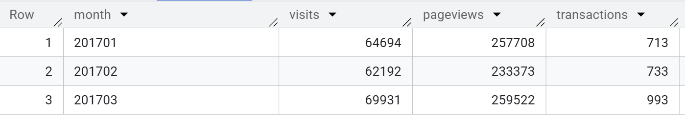
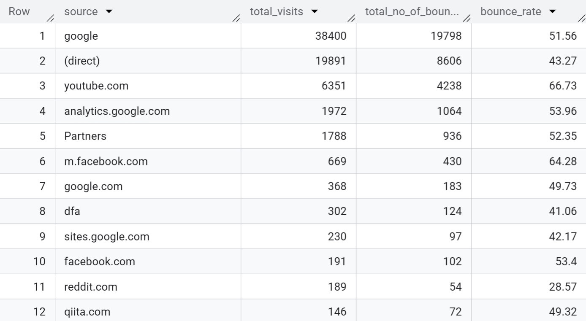
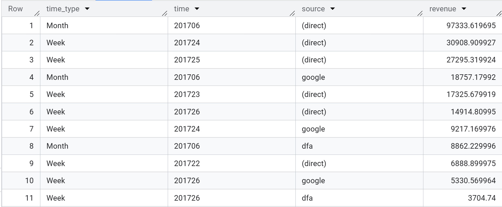
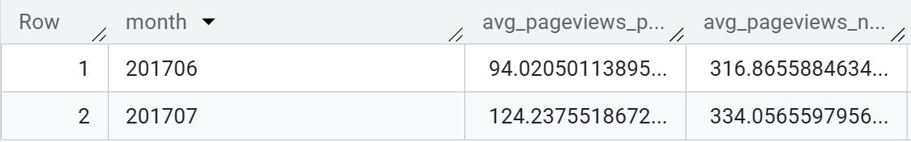
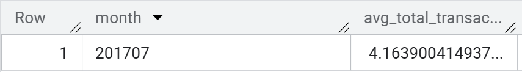
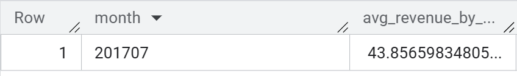
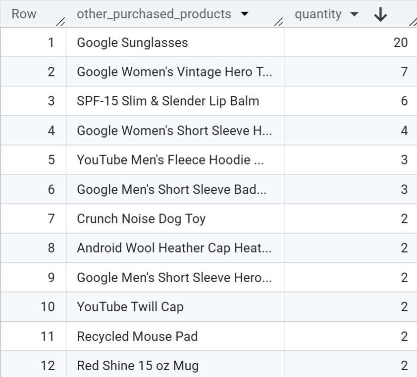
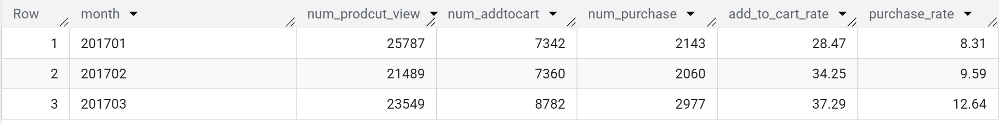

# Customer Purchase Behaviors on Google Merchandise Store in 2017

🔗 **BigQuery Dataset**: [Link](https://console.cloud.google.com/bigquery?sq=59475521650:be1ba7d02b83428da2194f8e6d0a6983)


## 1. Project Overview
- Project utilizing the BigQuery Public Dataset: Google Analytics Sample (ga_sessions_2017), a real-world dataset simulating user behavior on an e-commerce website.
- Developed a series of SQL queries to analyze customer behavior, marketing channel performance, and sales effectiveness.
## 2. Analysis

### 1️⃣ Query 1: Total visits, pageviews, transactions (Jan–Mar 2017)
```sql
SELECT
  FORMAT_DATE('%Y%m', PARSE_DATE('%Y%m%d', date)) AS month,
  SUM(totals.visits) AS visits,
  SUM(totals.pageviews) AS pageviews,
  SUM(totals.transactions) AS transactions
FROM `bigquery-public-data.google_analytics_sample.ga_sessions_2017*`
WHERE _table_suffix BETWEEN '0101' AND '0331'
GROUP BY month
ORDER BY month;
```



### 2️⃣ Query 02: Bounce rate per traffic source in July 2017 (Bounce_rate = num_bounce/total_visit) (order by total_visit DESC)
``` sql
SELECT
    trafficSource.source AS source,
    SUM(totals.visits) AS total_visits,
    SUM(totals.Bounces) AS total_no_of_bounces,
    ROUND((SUM(totals.Bounces)/SUM(totals.visits))* 100.00,2) AS bounce_rate
FROM `bigquery-public-data.google_analytics_sample.ga_sessions_201707*`
GROUP BY 1
ORDER BY 2 DESC;
```



### 3️⃣ Query 3: Revenue by traffic source by week, by month in June 2017
``` sql
WITH 
month AS (
      SELECT 'Month' AS time_type
              ,FORMAT_DATETIME('%Y%m', (PARSE_DATETIME('%Y%m%d', date))) AS time
              ,trafficSource.source AS source
              ,SUM(product.productRevenue)/1000000 AS revenue
      FROM `bigquery-public-data.google_analytics_sample.ga_sessions_201706*`,
            UNNEST (hits) hits,
            UNNEST (hits.product) product 
            WHERE product.productRevenue IS NOT NULL
      GROUP BY 2,3
)

, week AS (
      SELECT 'Week' AS time_type
              ,FORMAT_DATETIME('%Y%W', (PARSE_DATETIME('%Y%m%d', date))) 
              ,trafficSource.source
              ,SUM(product.productRevenue)/1000000 
      FROM `bigquery-public-data.google_analytics_sample.ga_sessions_201706*`,
            UNNEST (hits) hits,
            UNNEST (hits.product) product 
            WHERE product.productRevenue IS NOT NULL
      GROUP BY 2,3)

SELECT * FROM month 
UNION ALL 
SELECT * FROM week 
ORDER BY revenue DESC;
```



### 4️⃣ Query 04: Average number of pageviews by purchaser type (purchasers vs non-purchasers) in June, July 2017.
``` sql
WITH 
purchase AS (
      SELECT
            FORMAT_DATE("%Y%m",PARSE_DATE("%Y%m%d",date)) AS month
            ,(SUM(totals.pageviews)/COUNT(DISTINCT fullvisitorid)) AS avg_pageviews_purchase,
      FROM `bigquery-public-data.google_analytics_sample.ga_sessions_2017*`,
            UNNEST (hits) hits,
            UNNEST(product) product
      WHERE date BETWEEN '20170601' AND '20170731'
            AND totals.transactions>=1
            AND product.productRevenue is not null
      GROUP BY month
)

,non_purchase AS(
      SELECT
            FORMAT_DATE("%Y%m",PARSE_DATE("%Y%m%d",date)) AS month
            ,SUM(totals.pageviews)/COUNT(DISTINCT fullvisitorid) AS avg_pageviews_non_purchase,
      FROM `bigquery-public-data.google_analytics_sample.ga_sessions_2017*`,
            UNNEST (hits) hits,
            UNNEST (product) product
      WHERE date BETWEEN '20170601' AND '20170731'
            AND totals.transactions is null
            AND product.productRevenue is null
      GROUP BY  month
)

SELECT 
      purchase.month
      ,avg_pageviews_purchase
      ,avg_pageviews_non_purchase
FROM purchase
FULL JOIN non_purchase USING (month)
ORDER BY 1;
```



### 5️⃣ Query 05: Average number of transactions per user that made a purchase in July 2017
```sql
SELECT
      FORMAT_DATE("%Y%m",PARSE_DATE("%Y%m%d",date)) AS month
      ,SUM(totals.transactions)/COUNT(DISTINCT fullvisitorid) AS avg_total_transactions_per_user
FROM `bigquery-public-data.google_analytics_sample.ga_sessions_201707*`,
    UNNEST (hits) hits,
    UNNEST (product) product
WHERE totals.transactions>=1
      AND product.productRevenue IS NOT NULL
GROUP BY 1;
```



### 6️⃣ Query 06: Average amount of money spent per session. Only include purchaser data in July 2017
```sql
SELECT 
      FORMAT_DATE('%Y%m',PARSE_DATE('%Y%m%d',date)) AS month
      ,(SUM(product.productRevenue)/SUM(totals.visits))/1000000 AS avg_revenue_by_user_per_visit
FROM `bigquery-public-data.google_analytics_sample.ga_sessions_201707*`,
      UNNEST (hits) hits,
      UNNEST (hits.product) product 
WHERE totals.transactions IS NOT NULL 
    AND product.productRevenue IS NOT NULL
GROUP BY 1;
```



### 7️⃣  Query 07: Other products purchased by customers who purchased product "YouTube Men's Vintage Henley" in July 2017. Output should show product name and the quantity was ordered.
```sql
SELECT 
      product.v2ProductName AS other_purchased_products
      ,SUM(product.productQuantity) AS quantity
FROM `bigquery-public-data.google_analytics_sample.ga_sessions_201707*`,
      UNNEST (hits) hits,
      UNNEST (hits.product) product
WHERE fullVisitorId IN ( SELECT fullVisitorId
                          FROM `bigquery-public-data.google_analytics_sample.ga_sessions_201707*`,
                              UNNEST (hits) hits,
                              UNNEST (hits.product) product
                          WHERE product.v2ProductName  = "YouTube Men's Vintage Henley"
                                AND product.productRevenue IS NOT NULL
                                AND totals.transactions >= 1
                          GROUP BY 1)
      AND product.v2ProductName  <> "YouTube Men's Vintage Henley"
      AND product.productRevenue IS NOT NULL
      AND totals.transactions >= 1
GROUP BY 1
ORDER BY 2;
```



### 8️⃣ Query 8: Calculate cohort map from product view to addtocart to purchase in Jan, Feb and March 2017. For example, 100% product view then 40% add_to_cart and 10% purchase.
```sql
WITH 
product AS(
      SELECT 
            FORMAT_DATE('%Y%m',PARSE_DATE('%Y%m%d',date)) AS month
            ,COUNT(CASE WHEN eCommerceAction.action_type ='2' THEN product.v2ProductName END) AS num_prodcut_view
            ,COUNT(CASE WHEN eCommerceAction.action_type ='3' THEN product.v2ProductName END) AS num_addtocart
            ,COUNT(CASE WHEN eCommerceAction.action_type ='6' AND product.productRevenue IS NOT NULL THEN product.v2ProductName END) AS num_purchase
      FROM `bigquery-public-data.google_analytics_sample.ga_sessions_2017*`,
            UNNEST (hits) hits,
            UNNEST (hits.product) product
      WHERE date BETWEEN '20170101' AND '20170331'
      GROUP BY 1
      ORDER BY 1
)

SELECT
      month 
      ,num_prodcut_view
      ,num_addtocart
      ,num_purchase
      ,ROUND((num_addtocart/num_prodcut_view)*100,2) add_to_cart_rate
      ,ROUND((num_purchase/num_prodcut_view)*100,2) purchase_rate
FROM product;

```




